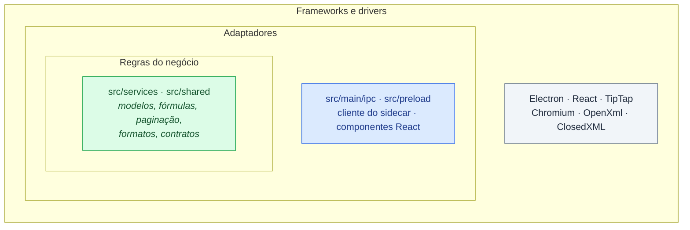

# Contribuindo com o Librevia

Obrigado pelo interesse. Este guia diz como relatar um problema, como preparar uma mudança e
quais padrões o código segue. A maior parte desses padrões é conferida por máquina: se o
`npm run verify` passa, a mudança já está quase toda dentro deles.

---

## 📑 Índice

- [O relato mais útil](#o-relato-mais-útil)
- [Preparar o ambiente](#preparar-o-ambiente)
- [Antes de abrir o pull request](#antes-de-abrir-o-pull-request)
- [Princípios](#princípios)
  - [Clean Code](#clean-code)
  - [Clean Architecture](#clean-architecture)
  - [SOLID](#solid)
  - [Outras boas práticas](#outras-boas-práticas)
- [Fronteiras entre as camadas](#fronteiras-entre-as-camadas)
- [Tamanho e complexidade das funções](#tamanho-e-complexidade-das-funções)
- [Contratos que mudam juntos](#contratos-que-mudam-juntos)
- [Textos da interface](#textos-da-interface)
- [Testes](#testes)
- [Dependências](#dependências)
- [Idioma](#idioma)
- [Commits](#commits)

---

## O relato mais útil

**É um arquivo que não abriu direito.** O projeto é calibrado com documentos reais, e cada
`.docx` ou `.xlsx` que se comporta de um jeito inesperado ensina mais que uma função nova.

Use o modelo **"Arquivo que abriu errado"** ao abrir a issue. Se puder, anexe o arquivo. Se ele
for confidencial, descreva o que o Word ou o LibreOffice mostram e o que o Librevia mostrou.

Falhas de segurança **não** vão em issue pública: veja a [política de segurança](SECURITY.md).

---

## Preparar o ambiente

Você precisa do **Node.js 22** ou mais novo e do **.NET SDK 10**.

```bash
git clone https://github.com/VStorch/LibreviaWorkspace.git
cd LibreviaWorkspace
npm install
npm run sidecar:build   # publica o serviço de formatos .NET
npm run dev             # abre o aplicativo com recarga automática
```

A lista completa de comandos está no [README](README.md#rodando-localmente).

---

## Antes de abrir o pull request

```bash
npm run format:check
npm run verify
```

São as mesmas verificações que o CI roda: formatação, tipos, lint, testes do TypeScript e do
.NET, licenças e traduções. Se passam na sua máquina, passam no CI. Para corrigir a formatação,
`npm run format`.

Se a mudança mexe na interface, rode também os testes de ponta a ponta:

```bash
npm run e2e
```

O modelo de pull request traz uma lista curta do que conferir.

---

## Princípios

Por que um projeto pessoal se preocupa tanto com a forma do código? Porque um editor de
documentos é grande e vive muito tempo. O Librevia tem cerca de 70 mil linhas, e a maior parte
do trabalho nele não é escrever código novo: é **ler** código que já existe para mudar uma parte
sem quebrar outra. Código fácil de ler é código barato de mudar.

Os princípios abaixo são a forma de manter isso. Cada um vem com o que significa e com o lugar
onde ele aparece no Librevia. As regras práticas das seções seguintes são a aplicação deles.

### Clean Code

"Código limpo" é código que outra pessoa entende na primeira leitura, sem precisar perguntar a
quem escreveu. Não é uma regra só, mas um conjunto de hábitos:

| Hábito | O que significa | Como aparece aqui |
| --- | --- | --- |
| **Nomes que dizem o que a coisa é** | quem lê o nome não precisa abrir a função para saber o que ela faz; nada de `data`, `tmp`, `x2` ou abreviação que só o autor entende | `recalculate`, `discardDraft`, `MAX_FILE_BYTES`, `PATH_NOT_AUTHORIZED` |
| **Funções pequenas, que fazem uma coisa** | se a descrição de uma função precisa de um "e", provavelmente são duas funções | os [limites de tamanho e complexidade](#tamanho-e-complexidade-das-funções), cobrados pelo lint |
| **Poucos parâmetros** | uma chamada com sete argumentos posicionais obriga quem lê a contar vírgulas; um objeto com nomes se explica sozinho | `max-params` 5; acima disso, objeto de opções, como em `usePagination` |
| **Sem números mágicos** | um `20971520` solto não diz nada; `MAX_FILE_BYTES` diz o que é e muda num lugar só | constantes nomeadas para limites, versões de formato e rótulos de aviso |
| **O código se explica sozinho** | se um trecho precisa de comentário para ser entendido, o trecho é que precisa melhorar: um nome melhor, uma função extraída, uma constante com nome. Comentário envelhece sem que o compilador perceba; o código, não | o *porquê* mora no nome, no teste e no commit. Um comportamento copiado do Excel vira um teste cujo nome o descreve, por exemplo "`=-2^2` vale 4, como no Excel" |
| **Sem efeito escondido** | uma função chamada `formatCell` não grava nada no disco; o nome promete, e o corpo cumpre | a lógica pura em `src/services/` não toca disco, rede nem tela |
| **Erro tratado de propósito** | o erro tem tipo e mensagem que a pessoa entende, em vez de uma exceção genérica engolida ou propagada sem contexto | `AppError` com `ErrorCode`; na planilha, erro é valor (`#DIV/0!`) e se propaga sem derrubar o cálculo |
| **Sem duplicação** | a mesma regra escrita em dois lugares diverge na primeira mudança feita às pressas | os rótulos de `Inventory.cs` são constantes; os textos da interface vivem num catálogo só |
| **Deixe melhor do que encontrou** | ao mexer num arquivo, arrume o que estiver ao alcance — um nome ruim, uma função grande da lista de exceções | `npm run lint:prune` registra cada função antiga que foi corrigida |
| **Formatação que ninguém discute** | o formatador decide espaços e quebras, e a revisão fala do que importa | Prettier, conferido no CI |

#### Quando um comentário ainda cabe

Comentário é a exceção, para o que o código **não tem como dizer**:

- uma restrição de fora, como a assinatura de um callback que a biblioteca impõe;
- um comportamento contraintuitivo que o Word, o Excel ou o formato exigem, quando nem o nome
  nem o teste deixam isso claro para quem lê aquele trecho;
- o motivo de um `eslint-disable`.

Nesses casos, o comentário diz **por quê**, nunca **o quê**. Comentário que repete o código,
narra a história da mudança ou guarda código desligado é apagado.

### Clean Architecture

"Arquitetura limpa" é uma forma de organizar o código em camadas, de modo que **as regras do
negócio não dependam dos detalhes técnicos**. Imagine círculos, um dentro do outro:



- **No centro ficam as regras do negócio**: como uma fórmula é calculada, onde uma página quebra,
  o que um `.sdoc` guarda. É a parte que dá valor ao programa e a que menos deveria mudar por
  motivo técnico.
- **Em volta ficam os adaptadores**, que traduzem entre o centro e o mundo de fora: o canal de
  IPC, o preload, o cliente do sidecar, os componentes de tela.
- **Na borda ficam os frameworks**: Electron, React, TipTap, as bibliotecas de formato.

A regra que segura tudo é a **regra da dependência**: o código só pode depender de quem está
**mais para dentro**. O centro não sabe que existe Electron, React ou disco. Por isso:

- **as regras do negócio se testam sem nada em volta.** Os 1.386 testes de unidade rodam em
  poucos segundos, sem abrir janela;
- **trocar um detalhe técnico não mexe no centro.** O cálculo das fórmulas não sabe se a
  planilha veio de um `.xlsx` ou de um `.ssheet`, nem se vai para a tela ou para o papel;
- **os dados atravessam as fronteiras em formatos simples e validados**: objetos conferidos por
  esquemas Zod no IPC, JSON e bytes no protocolo do sidecar.

No Librevia essa regra **não depende de boa vontade**: o lint reprova um `import` que aponte para
fora. A tabela de [fronteiras entre as camadas](#fronteiras-entre-as-camadas) é a regra da
dependência escrita como configuração.

Há uma concessão consciente: as extensões do editor (`src/renderer/document/extensions/`) vivem
coladas ao ProseMirror, porque é ele quem chama o código delas. O que é regra de verdade — numerar
uma lista, decidir uma quebra de página — sai dali para `src/services/` sempre que dá.

### SOLID

Cinco princípios de design, conhecidos pelas iniciais em inglês:

| Princípio | O que significa | Como aparece aqui |
| --- | --- | --- |
| **S** — Responsabilidade única | uma parte do código tem um só motivo para mudar | o sidecar só lê e escreve formatos; quem grava no disco é o main; quem desenha é o renderer |
| **O** — Aberto/fechado | dá para acrescentar comportamento sem reescrever o que já funciona | uma função de planilha nova é uma definição a mais no catálogo; o avaliador de fórmulas não muda |
| **L** — Substituição de Liskov | quem implementa um contrato pode entrar no lugar de outro sem surpresa | toda função de planilha segue o mesmo contrato (`FunctionDefinition`), e o avaliador chama `SOMA` e `PROCV` do mesmo jeito |
| **I** — Segregação de interfaces | ninguém depende do que não usa | o preload expõe só `window.api`, com os canais que a tela precisa, e não o Electron inteiro |
| **D** — Inversão de dependência | a regra recebe de fora o que é detalhe, em vez de buscá-lo sozinha | `recalculate` recebe o relógio (`now`) como parâmetro, e por isso `HOJE()` se testa com uma data fixa |

### Outras boas práticas

- **Simples antes de esperto (KISS).** A solução mais simples que resolve o problema é a melhor
  até que se prove o contrário.
- **Só o que é preciso agora (YAGNI).** Não se escreve código para um uso que talvez venha. Uma
  abstração nasce quando o segundo caso aparece, e não antes.
- **Validar na fronteira, confiar dentro.** Tudo que chega de fora — IPC, arquivo, protocolo — é
  conferido ao entrar. Lá dentro, o tipo garante o resto.
- **Falhar cedo e com clareza.** Um `.sdoc` de versão mais nova que o aplicativo é recusado com
  uma mensagem, em vez de aberto pela metade.
- **Tipos estritos.** TypeScript em modo estrito, com `noUncheckedIndexedAccess`, e sem `any`.
  O compilador é o primeiro revisor.
- **Imutável por padrão.** Modelos com campos `readonly`: quem recebe um modelo não o altera por
  baixo dos panos. `recalculate`, por exemplo, devolve uma planilha nova.
- **Seguro por padrão.** Sandbox ligada, caminhos autorizados, nenhum acesso à rede. Cada
  permissão é concedida, nunca presumida.
- **Medir antes de otimizar.** As decisões de desempenho do README vieram de medições, e não de
  palpites.
- **Mudança pequena, com teste.** Um commit faz uma coisa e chega com o teste que a prova.

---

## Fronteiras entre as camadas

O código tem quatro partes, e cada uma só pode importar o que precisa:

| Pasta | Pode importar | Não pode importar |
| --- | --- | --- |
| `src/services/`, `src/shared/` | só código puro | `electron`, `react`, `node:*`, `@main/*`, `@renderer/*` |
| `src/renderer/` | React, `@services/*`, `@shared/*` | `electron`, `node:*`, `@main/*` |
| `src/preload/` | `electron`, `@shared/*` | todo o resto |
| `src/main/` | tudo | — |

Por quê? `services` e `shared` rodam dos dois lados e se testam sem o Electron. O renderer roda
isolado e só fala com o resto por `window.api`.

**O lint cobra isso.** Quem esquecer recebe o erro no `npm run lint`, antes de qualquer revisão.

---

## Tamanho e complexidade das funções

Uma função muito longa ou com muitos caminhos é difícil de ler e de testar. Os limites abaixo
saíram da medição do próprio código e são conferidos pelo ESLint em `src/` (os testes ficam de
fora):

| Regra | Limite | O que mede |
| --- | --- | --- |
| `complexity` | 20 | caminhos possíveis pela função: cada `if`, `case`, `&&`, `??` e laço soma um |
| `max-lines-per-function` | 80 | linhas de código, sem contar comentários e linhas em branco |
| `max-depth` | 4 | blocos aninhados uns dentro dos outros |
| `max-params` | 5 | parâmetros; acima disso, use um objeto de opções |

Para comparar: a função típica do projeto tem complexidade 3 e 7 linhas.

### Os limites sobem em degraus

Quando os limites entraram, 76 funções já passavam deles. Em vez de reescrevê-las de uma vez,
elas foram **congeladas** em `eslint-suppressions.json`, que guarda quantas exceções cada arquivo
tem. A regra passa a valer assim:

- **código novo** acima do limite reprova;
- uma função antiga que **piora** também reprova, porque o arquivo passa a ter mais exceções do
  que o registrado;
- quem **corrige** uma função da lista roda `npm run lint:prune`, que tira a exceção do arquivo.
  Sem isso o lint reclama de uma exceção que não existe mais.

A meta é baixar a complexidade para 15 quando a lista estiver menor.

### Quando a exceção à regra é legítima

Às vezes a assinatura não é nossa. Um callback do ProseMirror, por exemplo, recebe seis
parâmetros porque a biblioteca manda seis. Nesse caso, desligue a regra **só naquela linha** e
escreva o motivo:

```ts
// A assinatura é a do ProseMirror, e não nossa.
// eslint-disable-next-line max-params
handleDoubleClickOn(view, _pos, node, nodePos, _event, direct) {
```

---

## Contratos que mudam juntos

- **IPC:** todo canal tem um esquema Zod em `src/shared/`, conferido nas duas pontas. Canal
  novo, esquema novo.
- **Protocolo do sidecar:** os dois lados, `src/main/sidecar/protocol.ts` e
  `sidecar/src/Librevia.Format/Protocol/Frame.cs`, mudam no mesmo commit. O teste
  `sidecar-real.test.ts` conversa com o executável de verdade e pega a diferença.
- **Formatos próprios:** `.sdoc` e `.ssheet` têm número de versão. Mudou o que eles guardam,
  suba a versão e mantenha a leitura das versões antigas.
- **Avisos de perda:** os rótulos do `Inventory.cs` são constantes. Use a constante; nunca
  escreva a frase de novo em outro lugar.

---

## Textos da interface

Toda frase que a pessoa lê vem do catálogo em `src/shared/i18n/catalog/`, com as duas línguas lado
a lado:

```ts
'comments.action.reply': { pt: 'Responder', en: 'Reply' },
```

O compilador acusa uma entrada sem uma das línguas. O `npm run i18n:check` acusa uma frase
escrita direto no código, fora do catálogo.

---

## Testes

O teste acompanha a mudança, na camada certa:

| O que mudou | Onde testar |
| --- | --- |
| regra de negócio, modelo, fórmula, formato | Vitest, ao lado do arquivo (`*.test.ts`) |
| leitura ou escrita de DOCX e XLSX | xUnit, em `sidecar/tests/` |
| o que só aparece com o aplicativo montado | Playwright, em `e2e/` |

A regra de negócio mora em camada pura justamente para ser testada sem subir o Electron.

Os documentos reais usados para calibrar o projeto **não entram no repositório**. Os testes que
dependem deles são pulados quando a variável `LIBREVIA_CORPUS_DOC` não está definida.

---

## Dependências

Antes de acrescentar uma, pese o que ela traz junto. Toda dependência de produção passa pelo
portão de licenças (`npm run licenses:check` e `npm run sidecar:licenses`), que só aceita licenças
permissivas — MIT, BSD, Apache-2.0, ISC e parecidas — e reprova o pacote que não declara licença.

---

## Idioma

- **Identificadores em inglês:** nomes de arquivo, função, variável e tipo.
- **Mensagens ao usuário, nomes de teste e os raros comentários em português.**
- **Commits em inglês.**

---

## Commits

[Conventional Commits](https://www.conventionalcommits.org), com escopo sempre que houver um:

```text
type(scope): description
```

- **Tipos em uso:** `feat`, `fix`, `refactor`, `perf`, `test`, `docs`, `build`, `ci`, `chore`
  e `revert`.
- **Escopos:** vêm do próprio código, como `docx`, `xlsx`, `styles`, `pagination`, `lists`,
  `sections`, `comments`, `revisions`, `notes`, `equations`, `sidecar`, `print` e `ui`.
- **O corpo é curto, ou não existe.** Uma ou duas frases dizendo *por quê*, quando o título não
  basta. Se o título já diz tudo, não escreva corpo.

```text
fix(docx): line height multiplies the font's height, not its size

LibreOffice puts 12.98 pt in Arial 10 pt; we were applying the factor to the size.
```

- **Sem rodapé:** nada de `Co-Authored-By` de ferramentas ou de assinatura automática no fim da
  mensagem.
