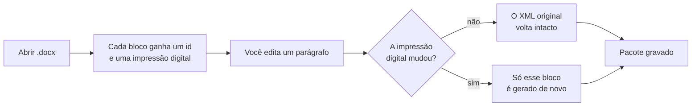
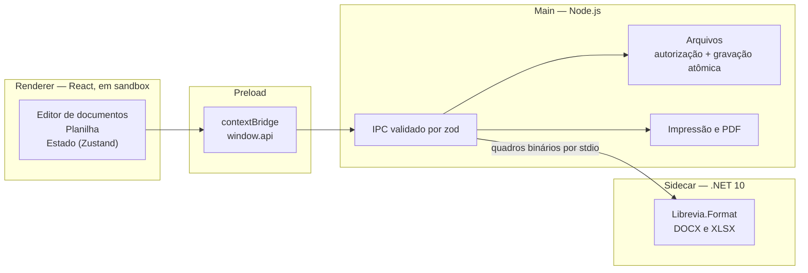
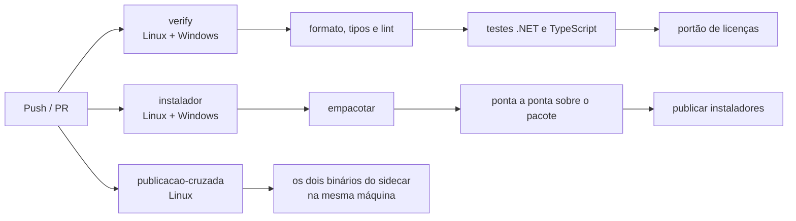

# Librevia

Suíte de documentos e planilhas para desktop — **offline do começo ao fim**, com uma promessa
incomum: salvar um `.docx` ou um `.xlsx` **não custa o que você não editou**.

[](https://github.com/VStorch/LibreviaWorkspace/actions/workflows/ci.yml)


> **Nome provisório.** Estado atual: suíte completa, com instalador para Linux e Windows.

## 🔗 Links

- 📖 **[Manual de uso](MANUAL.md)** — para quem *usa* o aplicativo. Este README é para quem mexe no código.
- ⚙️ **[Pipeline de CI](https://github.com/VStorch/LibreviaWorkspace/actions/workflows/ci.yml)** — tipos, lint, testes e instaladores nos dois sistemas.

---

## 📑 Índice

| | |
| --- | --- |
| [📌 O que já funciona](#o-que-já-funciona) | [🧱 Arquitetura](#arquitetura) |
| [📄 Formatos](#formatos) | [🔌 Por que há .NET num projeto Electron](#por-que-há-net-num-projeto-electron) |
| [🚀 Tecnologias](#tecnologias) | [🖨️ PDF e impressão](#pdf-e-impressão) |
| [🔬 Salvar não custa o que você não editou](#salvar-não-custa-o-que-você-não-editou) | [💾 Recuperação depois de uma queda](#recuperação-depois-de-uma-queda) |
| [🧮 Fórmulas em português](#fórmulas-em-português) | [⚡ Desempenho, medido](#desempenho-medido) |
| [▶️ Rodando localmente](#rodando-localmente) | [🧪 Testes](#testes) |
| [🔄 CI/CD](#cicd) | [📦 Empacotamento](#empacotamento) |
| [🛡️ Portões de qualidade](#portões-de-qualidade) | [🗺️ Limites conhecidos](#limites-conhecidos) |
| [🤝 Contribuindo](#contribuindo) | [📜 Licença](#licença) |

---

<a id="o-que-já-funciona"></a>

## 📌 O que já funciona

| Área | O que entrega |
| --- | --- |
| **Documentos** | formatação, títulos, listas, recuo, espaçamento, alinhamento, tabelas, imagens, links, quebra de página, localizar/substituir |
| **Planilhas** | grade de 10 mil linhas, seleção de intervalo, alça de preenchimento, área de transferência, abas, formatação, congelamento, inserir/excluir linhas e colunas |
| **Fórmulas** | 52 funções em português e inglês, referências entre abas, barra de fórmulas |
| **DOCX** | abre e grava com [edição cirúrgica](#salvar-não-custa-o-que-você-não-editou) |
| **XLSX** | abre e grava com a mesma cirurgia, traduzindo as fórmulas na fronteira |
| **PDF e impressão** | documentos e planilhas, com cabeçalho, rodapé, numeração, margens e orientação |
| **Recuperação** | rascunho de oito em oito segundos, oferecido de volta depois de uma queda |
| **Somente leitura** | graduado: trava só quando o arquivo tem o que se perde ao editar |
| **Distribuição** | AppImage, `.deb` e instalador NSIS, com os avisos de terceiros |

---

<a id="formatos"></a>

## 📄 Formatos

| Extensão | O que guarda |
| --- | --- |
| `.sdoc` | formato interno do documento: completo, com formatação — sem perda |
| `.ssheet` | formato interno da planilha: valores, fórmulas e formatação — sem perda |
| `.docx` | Word; abre e grava preservando o que não foi editado |
| `.xlsx` | Excel; abre e grava preservando o que não foi editado |
| `.txt` | apenas texto; salvar nele descarta formatação, e o aplicativo avisa antes |
| `.pdf` | saída apenas (exportação e impressão) |

<details>
<summary><b>Por que ODT e ODS estão fora do escopo</b></summary>

<br>

Não existe biblioteca madura e de licença permissiva em nenhum ecossistema — no .NET tudo
que presta é comercial, e no npm a opção viável tem seis meses de vida e um mantenedor.

Na prática isso quase nunca aparece: arquivos `.docx` e `.xlsx` funcionam vindos tanto do
Office quanto do LibreOffice, e o LibreOffice grava nos dois formatos pelo "Salvar como".

</details>

---

<a id="tecnologias"></a>

## 🚀 Tecnologias

| Camada | O que usa |
| --- | --- |
| **Aplicativo** | Electron 43, com `contextIsolation`, `sandbox` e `nodeIntegration` desligado |
| **Interface** | React 19, TypeScript 5.9 (estrito), Zustand 5 |
| **Editor de texto** | TipTap 3 / ProseMirror |
| **Grade** | RevoGrid 4 (virtualizada) |
| **Contratos** | Zod 4 — todo IPC é validado nas duas pontas |
| **Formatos Office** | sidecar .NET 10 com DocumentFormat.OpenXml 3.5 e ClosedXML 0.105 |
| **PDF** | o próprio Chromium, via `printToPDF` |
| **Build** | Vite 7 / electron-vite 5, electron-builder 26 |
| **Testes** | Vitest 4, xUnit (.NET), Playwright 1.62 |

---

<a id="salvar-não-custa-o-que-você-não-editou"></a>

## 🔬 Salvar não custa o que você não editou

Este é o motivo do projeto existir. Um editor comum **regenera** o pacote OOXML a cada
salvamento, e nisso apaga em silêncio comentários, revisões, notas e formas — tudo que o
importador não entendeu. Aqui a gravação é **cirúrgica**: cada bloco que você não tocou volta
para o arquivo exatamente como estava.



**Medido**, e não prometido:

| Cenário | Resultado |
| --- | --- |
| Documento de 105 blocos, salvo sem editar | **0** blocos reescritos |
| O mesmo documento, com um parágrafo editado | **1** bloco reescrito |
| Partes do pacote que mudam | só `word/document.xml`; as outras 25 saem idênticas byte a byte |
| Planilha do LibreOffice, aberta e salva sem editar | **0** células escritas, 18 preservadas |
| A mesma planilha, com uma quantidade alterada | **4** células — a digitada e as três fórmulas que dependiam dela |

A fidelidade não vem de entender o OOXML inteiro. Vem de **não mexer** no que não foi editado.

### Três avisos que a maioria dos programas mistura num só

| Categoria | O que significa | Exemplos |
| --- | --- | --- |
| **Invisibilidade** | continua no arquivo, mas o editor não desenha | revisões, notas de rodapé, gráficos |
| **Perda** | some ao salvar — só se você editar o trecho que a ancora | comentário no parágrafo que você reescreveu |
| **Perda estrutural** | subconjunto da perda que **liga o somente leitura** | comentário, revisão, nota, campo calculado |

São avisos separados porque exigem reações diferentes. Um alerta genérico é um alerta que o
usuário aprende a fechar sem ler.

<details>
<summary><b>Por que o somente leitura é padrão, e por que não é cadeado</b></summary>

<br>

Perda de **aparência** — posicionamento de imagem, decoração — não trava nada: quase todo
documento corporativo tem uma imagem ancorada, e travar por causa disso travaria o uso do
dia a dia. O usuário aprenderia a liberar sem ler, e aí a proteção deixaria de proteger.

Quando o arquivo traz perda estrutural, ele abre travado e uma faixa diz **exatamente o
que está em jogo**. Um clique em "Editar mesmo assim" libera — para aquele arquivo, e só
para ele.

A classificação mora em `Inventory.cs`, e os rótulos são **constantes** usadas pelos
leitores: uma frase mudada num deles deixaria de casar com a lista, e o documento passaria
a abrir editável sem ninguém perceber. Sendo constantes, o compilador não deixa.

</details>

<details>
<summary><b>No XLSX o risco não é o pacote, é a célula</b></summary>

<br>

O arquivo diz `SUM(A1,B1)`; a tela diz `SOMA(A1;B1)`. A tradução acontece num lugar só — a
fronteira entre o processo main e o serviço de formato — e é feita **caractere a caractere**,
não reconstruindo a fórmula a partir da árvore sintática.

O motivo é medido, não estético. A gravação é cirúrgica também aqui: ela relê o arquivo
original, compara célula a célula e só toca no que mudou. Reconstruir a fórmula normalizaria
espaços e maiúsculas, toda célula pareceria diferente, e abrir e salvar sem editar
reescreveria a planilha inteira — apagando fonte, alinhamento vertical, recuo e bordas
diagonais, tudo que o modelo não representa.

A diferença para o DOCX vem de uma medição: a biblioteca de planilha **preserva as partes do
pacote que não modela** — uma parte de XML injetada à mão sobrevive à ida e volta, e gráficos
e tabelas dinâmicas sobrevivem pelo mesmo mecanismo. O que ela regenera é a planilha em si.

</details>

---

<a id="fórmulas-em-português"></a>

## 🧮 Fórmulas em português

```excel
=SOMA(1,5;2)      → 3,5
=SE(A1>10;"alto";"baixo")
=PROCV("Ana";A1:C50;3;FALSO)
```

**Vírgula é decimal, ponto e vírgula separa argumentos** — as duas regras do Excel em
português, e elas andam juntas: com a vírgula ocupada pelo decimal, ela não pode separar
nada. Quem escreve `SOMA(A1,B1)` recebe a frase dizendo qual é o separador, e não um erro
genérico.

| | |
| --- | --- |
| **52 funções** | contas, estatística, lógica, texto, procura e data — [lista completa no manual](MANUAL.md#funções-disponíveis) |
| **Dois idiomas** | `SOMA` e `SUM` são a mesma função, assim como `SE`/`IF` e `PROCV`/`VLOOKUP` |
| **Erro é valor** | `=A1/0` produz `#DIV/0!`, que se propaga — como no Excel, e ao contrário de derrubar o recálculo inteiro |
| **Estrutura acompanha** | inserir linha reescreve as referências, inclusive as de outras abas; renomear aba conserta as fórmulas que a citam |
| **A alça leva a fórmula** | `=B2*C2` arrastada para baixo vira `=B3*C3`, e a referência com `$` fica onde está |

<details>
<summary><b>Comportamentos do Excel reproduzidos de propósito</b></summary>

<br>

Cada um com o motivo escrito onde ele está, no código:

- `=-2^2` vale **4**;
- `="a"="A"` é verdadeiro, mas `=1="1"` é falso;
- texto dentro de um intervalo é ignorado por `SOMA`, mas convertido quando passado direto;
- `PROCV` procura aproximado por padrão.

O critério é sempre o mesmo: o mesmo arquivo precisa dar o mesmo número nos dois programas.

A exceção deliberada é `#CIRC!`, que o Excel não tem — lá uma referência circular mostra
zero e abre um aviso, deixando um número inventado no meio da planilha.

</details>

---

<a id="arquitetura"></a>

## 🧱 Arquitetura



| Pasta | Responsabilidade |
| --- | --- |
| `src/main/` | ciclo de vida, janelas, arquivos, impressão, IPC |
| `src/preload/` | ponte `contextBridge` — encaminhador, sem lógica |
| `src/renderer/` | interface React: editor de documentos, planilha, páginas |
| `src/services/` | lógica pura: modelos, DOCX/XLSX, fórmulas, PDF |
| `src/shared/` | contratos de IPC, tipos e erros usados pelas três camadas |
| `sidecar/` | serviço de formato em .NET, com os próprios testes |

### 🔒 Duas travas de segurança no processo main

Valem mesmo se o renderer for comprometido por um documento malicioso:

- **Gravação** (`file:save`) só aceita caminhos autorizados na sessão — abertos ou escolhidos
  pelo próprio usuário num diálogo nativo.
- **Leitura por atalho** (`file:open-recent`) só aceita caminhos que já estejam nos recentes.

Qualquer outro caminho é recusado com `PATH_NOT_AUTHORIZED`, sem chegar ao disco.

<a id="duas-regras-que-o-linter-faz-cumprir"></a>

### 📏 Duas regras que o linter faz cumprir

1. **`src/services/` e `src/shared/` não importam `electron`, `react` nem APIs do Node.**
   São camadas puras: rodam nos dois lados e são testáveis sem Electron rodando.
2. **O renderer não importa `electron` nem `node:*`.** Só `window.api`.

Quebrar qualquer uma das duas falha o `npm run lint` — não a revisão de código.

---

<a id="por-que-há-net-num-projeto-electron"></a>

## 🔌 Por que há .NET num projeto Electron

A edição cirúrgica exige um DOM tipado completo do OOXML, e o `DocumentFormat.OpenXml`
(MIT, da Microsoft) é o único maduro. Daí o sidecar em `sidecar/`.

Ele é um **serviço de formato**, não uma segunda aplicação: bytes entram por stdio, JSON sai.
Sem rede, sem porta, sem permissão de escrita — quem grava continua sendo o processo main,
com a autorização de caminho e a gravação atômica já existentes.

```text
[tamanho do JSON][tamanho do binário][JSON][binário]
```

O protocolo é um **quadro binário**, e não uma linha de texto: um DOCX é um ZIP, cheio de
`0x0a` e `0x00`, e qualquer protocolo delimitado por linha se despedaçaria nele.

<details>
<summary><b>O que acontece quando o sidecar morre</b></summary>

<br>

O documento aberto **não morre junto**: a operação em curso falha com uma frase
compreensível, e o próximo pedido sobe um processo novo. Ele encerra ao perder o stdin,
então nem um `SIGKILL` no aplicativo deixa processo órfão para trás.

Os dois lados do protocolo vivem em `src/main/sidecar/protocol.ts` e
`sidecar/src/Librevia.Format/Protocol/Frame.cs`, e **precisam mudar juntos** — quem garante
isso é `sidecar-real.test.ts`, que conversa com o executável publicado em vez de com uma
imitação.

</details>

---

<a id="pdf-e-impressão"></a>

## 🖨️ PDF e impressão

Não há biblioteca de PDF: quem gera é o próprio **Chromium**, pelo `printToPDF`. É o mesmo
motor que desenha o editor, então o PDF sai igual à tela — e o texto continua selecionável,
com as fontes embutidas.

O editor entrega o documento **já dividido em folhas**, e cada uma vira uma caixa do tamanho
do papel. Antes havia dois paginadores que precisavam concordar — o nosso e o do Chromium —
e uma categoria inteira de defeito morava nessa divergência.

> ⚠️ **Ao mexer em margens:** `printToPDF()` recebe **polegadas** e `webContents.print()`
> recebe **pixels CSS**. As duas conversões vivem juntas em `services/pdf/page-setup.ts`,
> com teste comparando uma com a outra.

---

<a id="recuperação-depois-de-uma-queda"></a>

## 💾 Recuperação depois de uma queda

De oito em oito segundos, o que está na tela é gravado num rascunho — **nunca por cima do seu
arquivo**. Gravar sozinho no arquivo transformaria "não salvei" em "salvei sem querer", e a
decisão de escrever continua sendo só do usuário.

Depois de uma queda, o aplicativo oferece o rascunho de volta numa faixa com duas ações.
Enquanto ela estiver na tela o autosave **não escreve**: sem isso, ignorar o aviso e começar a
digitar apagaria em segundos justamente o trabalho que ele existe para devolver.

Recuperar reata o que morreu junto com o processo — a autorização de gravação e os bytes
originais do pacote OOXML. Sem isso, salvar por cima do `.docx` recuperado seria recusado.

---

<a id="desempenho-medido"></a>

## ⚡ Desempenho, medido

Planilha de 20 mil linhas e **120 mil células**, com 20 mil fórmulas, gerada pelo LibreOffice.
Abrir de ponta a ponta: **≈ 3,5 s**.

| Etapa | Tempo |
| --- | --- |
| Serviço de formatos (ClosedXML lendo o pacote) | 1,9 s na primeira vez, 0,9 s depois |
| `parseWorkbook` (validação zod de 120 mil células) | 245 ms |
| `recalculate` (20 mil fórmulas) | 279 ms |
| Serializar o modelo (7,4 MB de JSON) | 50 ms |
| Autosave de um documento de 6 mil parágrafos | 4 ms — não aparece |

<details>
<summary><b>Duas decisões que saíram dessa medição</b></summary>

<br>

**Compilação antecipada (ReadyToRun) no sidecar, ligada.** Sem ela a primeira abertura custa
3,8 s; com ela, 1,9 s. No regime permanente ela *perde* ~100 ms, porque o código
pré-compilado é menos otimizado que o que o JIT produz depois de aquecer — mas a primeira
abertura é a que o usuário sente como travamento, e a diferença no regime permanente ninguém
percebe. Custa 41 MB por plataforma.

**Cache de formato numérico.** Uma planilha grande tem meia dúzia de máscaras e centenas de
milhares de células; interpretar a máscara passou a acontecer uma vez por máscara distinta.
O que sobra daquele trecho não é nosso: é o ClosedXML materializando `cell.Style` célula a
célula.

</details>

---

<a id="rodando-localmente"></a>

## ▶️ Rodando localmente

### Requisitos

- **Node.js 22** ou superior
- **.NET SDK 10** — para o sidecar de formatos

### Passos

```bash
# 1. clonar e instalar
git clone https://github.com/VStorch/LibreviaWorkspace.git
cd LibreviaWorkspace
npm install

# 2. publicar o sidecar .NET (baixa pacotes NuGet na primeira vez)
npm run sidecar:build

# 3. subir o aplicativo em modo desenvolvimento, com HMR
npm run dev
```

### Comandos

| Comando | O que faz |
| --- | --- |
| `npm run dev` | aplicativo em modo desenvolvimento, com HMR |
| `npm run build` | verificação de tipos + build de produção em `out/` |
| `npm test` | testes unitários (Vitest) |
| `npm run sidecar:test` | testes do sidecar (.NET) |
| `npm run e2e` | build + testes de ponta a ponta no aplicativo montado |
| `npm run verify` | **o mesmo que o CI roda**: tipos, lint, testes dos dois lados e licenças |
| `npm run dist` | instaladores AppImage e `.deb` em `release/` |
| `npm run dist:win` | instalador NSIS (rodando no Windows) |

> O `npm run verify` publica o sidecar antes de rodar os testes, porque o teste de ponta a
> ponta conversa com o binário de verdade.

---

<a id="testes"></a>

## 🧪 Testes

Três camadas, cada uma provando algo que a anterior não alcança:

| Camada | Ferramenta | O que prova | Quantos |
| --- | --- | --- | --- |
| **Unidade** | Vitest | lógica pura, processo main, contratos de IPC | 644 |
| **Sidecar** | xUnit (.NET) | leitura e gravação OOXML, ida e volta byte a byte | 140 |
| **Ponta a ponta** | Playwright + Electron | o aplicativo montado, com preload em sandbox e o sidecar publicado | 44 |

Seis dos testes de ponta a ponta rodam contra documentos reais e são **pulados** quando a
variável `LIBREVIA_CORPUS_DOC` não aponta para eles — o corpus não entra no repositório.

E os de ponta a ponta rodam também contra o **pacote montado**, que é a diferença entre "os
testes passam" e "o instalador funciona":

```bash
npm run dist
LIBREVIA_E2E_BINARY=release/linux-unpacked/librevia npm run test:e2e
```

---

<a id="cicd"></a>

## 🔄 CI/CD

Pipeline em GitHub Actions, disparado a cada push na `main` e em todo pull request.



| Job | Por que existe |
| --- | --- |
| `verify` | roda nos **dois sistemas**, porque o sidecar sobe processo filho e resolve caminhos — duas coisas que se comportam diferente em cada um |
| `instalador` | prova que caminhos de recurso, asar e o binário do sidecar continuam onde o código espera **depois de empacotar** |
| `publicacao-cruzada` | prova que uma máquina só consegue publicar os binários das duas plataformas |

---

<a id="empacotamento"></a>

## 📦 Empacotamento

`npm run dist` gera AppImage e `.deb`; `npm run dist:win` gera o instalador NSIS. O sidecar
fica **fora** do asar — executável dentro de arquivo compactado não roda — e cada plataforma
leva só o seu binário.

`npm run notices` gera o `THIRD-PARTY-NOTICES.md` que viaja no instalador. Ele cobre **três**
conjuntos, e não um: as dependências npm de produção, o Electron inteiro (com Chromium e
Node.js) e os pacotes NuGet do sidecar, que é publicado self-contained e leva o runtime do
.NET junto. O portão `licenses:check` olha só o primeiro — deixar os outros dois de fora daria
a impressão de conformidade sem a conformidade.

> 🚧 **Provisórios antes de distribuir de verdade:** o ícone (`build/icon.png`, gerado por
> `npm run icon`) e os endereços `.internal` do mantenedor do `.deb` e do `homepage`. O TLD
> `.internal` é reservado para uso interno — é honesto por construção, e melhor que inventar
> um domínio público que não existe.

---

<a id="portões-de-qualidade"></a>

## 🛡️ Portões de qualidade

O `npm run verify` reprova o código se:

- os tipos não fecharem — TypeScript estrito, com `noUncheckedIndexedAccess`;
- as [fronteiras de arquitetura](#duas-regras-que-o-linter-faz-cumprir) forem violadas;
- os testes falharem, incluindo os que travam as preferências de segurança da janela;
- alguma dependência trouxer licença fora da allowlist (MIT, BSD, Apache-2.0, ISC e afins).

<details>
<summary><b>Por que o portão de licenças reprova quem não declara nada</b></summary>

<br>

O aplicativo é de uso corporativo: uma dependência GPL/AGPL entrando sem querer é um problema
jurídico, não técnico. O portão cobre os dois ecossistemas — npm e NuGet — e reprova pacote
que **não declara licença SPDX**, e não só o que declara uma proibida.

Foi assim que a Six Labors trocou Apache-2.0 por licença própria numa dependência transitiva
do ClosedXML: quem só olha a lista de proibidas não vê uma troca dessas chegando.

</details>

---

<a id="limites-conhecidos"></a>

## 🗺️ Limites conhecidos

| Limite | Situação |
| --- | --- |
| **Criar `.docx` do zero** | não faz. Documento novo nasce `.sdoc`; gerar o pacote inteiro faria a promessa da edição cirúrgica deixar de valer. Planilha nova **pode** ser salva direto em `.xlsx` |
| **Mesclagem de células** | fora desta fase — toda biblioteca de grade madura a cobra |
| **Filtros de planilha** | preservados no arquivo, mas sem tela para criar ou alterar |
| **Fórmulas** | sem matrizes dinâmicas, referências de coluna inteira (`A:A`) ou intervalos nomeados |
| **Tamanho** | arquivos acima de 20 MB não abrem |
| **Paginação na tela** | é estimativa (o `≈` na barra de status); a exata é a da exportação para PDF |

---

<a id="contribuindo"></a>

## 🤝 Contribuindo

O Librevia é **open source**, sob licença MIT: use, estude, modifique e redistribua à
vontade. Contribuição é bem-vinda — issue, ideia, relato de arquivo que abriu errado ou
pull request.

**O relato mais valioso é um arquivo que não abriu direito.** O projeto se calibra contra
documentos reais, e cada `.docx` ou `.xlsx` que se comporta de um jeito inesperado ensina
mais que uma funcionalidade nova. Se puder anexar o arquivo, ótimo; se ele for confidencial,
descreva o que o Word ou o LibreOffice mostram e o que o Librevia mostrou.

### Antes de abrir o pull request

```bash
npm run verify
```

É o **mesmo comando que o CI roda**: tipos, lint, testes do TypeScript e do .NET, e o portão
de licenças. Se ele passa na sua máquina, passa no CI.

### O que o projeto espera do código

| | |
| --- | --- |
| **As fronteiras** | `src/services/` e `src/shared/` não importam `electron`, `react` nem `node:*`, e o renderer só fala por `window.api`. Quem esquecer, o lint lembra |
| **Teste junto** | regra de negócio vive em camada pura justamente para ser testável sem subir o Electron |
| **Dependência nova** | precisa passar pelo portão de licenças (MIT, BSD, Apache-2.0, ISC e afins) — e pesar o que traz junto |
| **Idioma** | código, comentários e commits em português, como o resto do repositório |

### Mensagens de commit

Não são Conventional Commits. O assunto é uma **frase afirmativa** dizendo o que passou a
valer, e o corpo explica **por quê** — de preferência com a medição que sustenta a decisão:

```text
A entrelinha é vez a altura da fonte, e não vez o tamanho dela

O múltiplo do OOXML é 1,13 vez a altura natural da fonte, e nós aplicávamos o
fator sobre o tamanho: 11,3 pt onde o LibreOffice põe 12,98 em Arial 10 pt.
```

O histórico é o registro técnico do projeto: é lá que mora o motivo de cada decisão que o
código sozinho não explica.

---

<a id="licença"></a>

## 📜 Licença

[MIT](LICENSE) — © 2026 Vinícius Storch.

As dependências viajam com as próprias licenças, todas permissivas e conferidas a cada build
pelo `npm run licenses:check`. O `THIRD-PARTY-NOTICES.md` que acompanha o instalador é gerado
por `npm run notices` e cobre os três conjuntos distribuídos: pacotes npm, o Electron inteiro
e os pacotes NuGet do sidecar.
