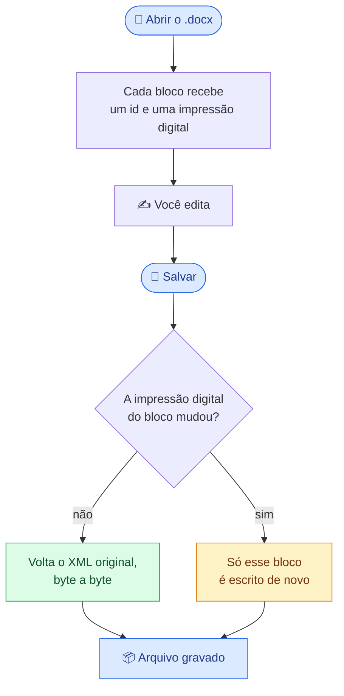
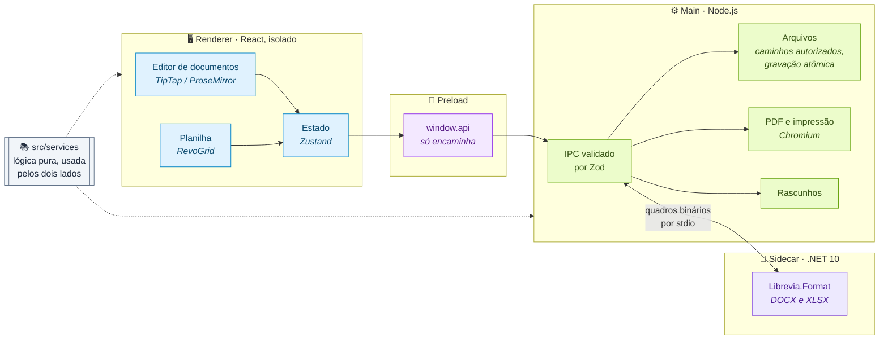
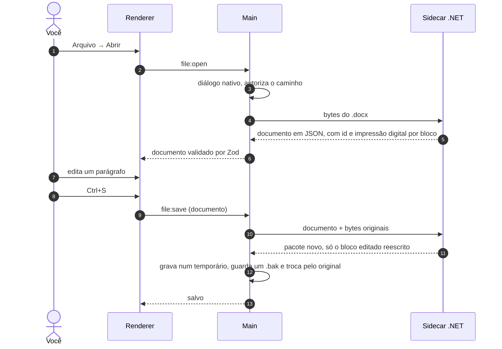
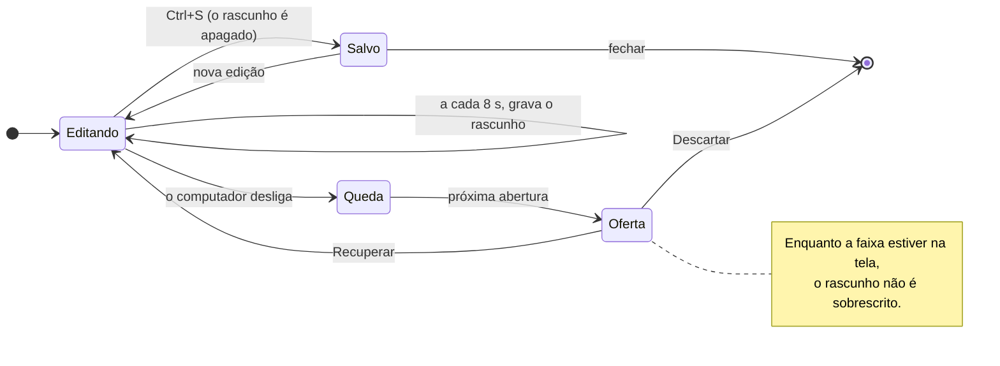
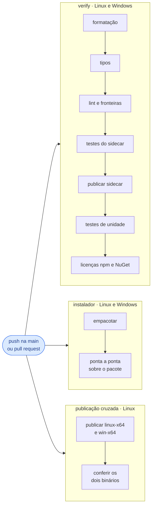

# Librevia

Editor de documentos e planilhas para o computador. Funciona **sem internet**, abre e grava
arquivos do Word e do Excel e, ao salvar, **regrava só o que você editou**.

[](https://github.com/VStorch/LibreviaWorkspace/actions/workflows/ci.yml)


Este README é para quem lê ou mexe no código. Quem só quer **usar** o aplicativo deve ler o
**[manual](MANUAL.md)**.

---

## 📑 Índice

**Conhecer**

- [O que é o Librevia](#o-que-é-o-librevia)
- [O que ele faz](#o-que-ele-faz)
- [Formatos](#formatos)
- [Salvar não custa o que você não editou](#salvar-não-custa-o-que-você-não-editou)
- [Fórmulas em português](#fórmulas-em-português)

**Por dentro**

- [Arquitetura](#arquitetura)
- [Mapa do código](#mapa-do-código)
- [Por que há .NET num projeto Electron](#por-que-há-net-num-projeto-electron)
- [A tela é a folha impressa](#a-tela-é-a-folha-impressa)
- [Recuperação depois de uma queda](#recuperação-depois-de-uma-queda)
- [Idiomas e aparência](#idiomas-e-aparência)
- [Desempenho, medido](#desempenho-medido)

**Trabalhar no código**

- [Requisitos](#requisitos)
- [Rodando localmente](#rodando-localmente)
- [Testes](#testes)
- [CI/CD](#cicd)
- [Empacotamento](#empacotamento)
- [Regras do código](#regras-do-código)
- [Limites conhecidos](#limites-conhecidos)
- [Onde saber mais](#onde-saber-mais)
- [Contribuindo](#contribuindo)
- [Licença](#licença)

---

<a id="o-que-é-o-librevia"></a>

## 💡 O que é o Librevia

Quem já abriu um `.docx` num editor diferente do Word e salvou conhece o problema. O texto
continua lá, mas os comentários somem, as revisões desaparecem, uma nota de rodapé vira
texto comum. Ninguém avisou.

Por que isso acontece? A maioria dos editores lê o arquivo, monta a própria versão dele e,
ao salvar, **escreve tudo de novo** a partir dessa versão. O que o editor não entendeu na
leitura não volta na escrita.

O Librevia faz o contrário. Ele guarda o arquivo original e, ao salvar, troca só os trechos
que você mudou. O resto volta byte a byte, como estava.

Imagine um livro impresso em que você corrige um parágrafo. Um editor comum digitaria o livro
inteiro de novo para mudar uma frase. O Librevia troca só a página corrigida e devolve as
outras como vieram.

Ele também:

- **não usa a rede**, nem para a ortografia, nem para as fontes;
- **avisa antes de perder alguma coisa**, e diz o quê;
- **guarda um rascunho** a cada oito segundos, para o caso de o computador desligar.

---

<a id="o-que-ele-faz"></a>

## 📌 O que ele faz

### Documentos

| Área | O que entrega |
| --- | --- |
| **Texto** | fontes, tamanhos, cores, destaque, caixa alta, versalete, sobrescrito e subscrito |
| **Estilos** | os estilos do próprio documento; aplicar, alterar e criar; documento novo em Calibri 11 |
| **Parágrafo** | recuo, espaçamento, alinhamento, viúvas e órfãs, manter com o próximo |
| **Listas** | listas de vários níveis numeradas como no Word; reiniciar, continuar e mudar o formato |
| **Página** | folhas de verdade na tela, cabeçalho, rodapé, numeração de página, margens, orientação, zoom de 50 % a 200 % |
| **Seções e colunas** | cada seção com o próprio papel e as próprias margens; texto em colunas |
| **Tabelas e imagens** | inserir e editar; cabeçalho de tabela repetido em cada folha; imagens ancoradas no texto |
| **Referências** | painel de navegação, sumário, marcadores, legendas e referência cruzada |
| **Notas** | notas de rodapé e de fim, editadas no pé da própria folha |
| **Revisão** | comentários com resposta e resolução; controle de alterações enquanto você digita; aceitar e rejeitar |
| **Equações** | mostra as equações do Word e permite escrever novas em LaTeX |
| **Modelos** | cria documentos a partir de modelos do Word (`.dotx`); quatro vêm com o aplicativo |
| **Ferramentas** | ortografia em português sem internet, localizar e substituir, contar palavras, caracteres especiais, autocorreção tipográfica, propriedades do documento |

### Planilhas

| Área | O que entrega |
| --- | --- |
| **Grade** | 10 mil linhas, seleção de intervalo, alça de preenchimento, área de transferência |
| **Estrutura** | abas, congelar linhas e colunas, inserir e excluir linhas e colunas |
| **Formatação** | número, moeda, percentual, data e texto; negrito, itálico, sublinhado, cores, alinhamento e bordas |
| **Fórmulas** | 52 funções em português e em inglês, referências entre abas, barra de fórmulas |

### Em volta dos dois

| Área | O que entrega |
| --- | --- |
| **PDF e impressão** | documentos e planilhas, com cabeçalho, rodapé, numeração, margens e orientação |
| **Exportar** | documento para PDF, HTML, Markdown e ODT |
| **Recuperação** | rascunho a cada oito segundos, oferecido de volta depois de uma queda |
| **Somente leitura** | só trava o arquivo quando editar pode apagar algo importante dele |
| **Interface** | português ou inglês; tema claro, escuro ou do sistema; modo de leitura |
| **Distribuição** | AppImage, `.deb` e instalador para Windows, com os avisos de licença de terceiros |

---

<a id="formatos"></a>

## 📄 Formatos

| Extensão | Abre | Salva | O que é |
| --- | :---: | :---: | --- |
| `.docx` | ✅ | ✅ | documento do Word; o que você não editou volta intacto |
| `.dotx` | ✅ | ✅ | modelo do Word; abrir cria um documento novo, sem título |
| `.dotm` | ✅ | — | modelo do Word com macros; abre como o `.dotx`, mas sem as macros (o app avisa) |
| `.xlsx` | ✅ | ✅ | planilha do Excel; o que você não editou volta intacto |
| `.sdoc` | ✅ | ✅ | documento do Librevia; guarda tudo, sem perda |
| `.ssheet` | ✅ | ✅ | planilha do Librevia; guarda tudo, sem perda |
| `.txt` | ✅ | ✅ | só texto; salvar nele descarta a formatação, e o app avisa antes |
| `.pdf` | — | exporta | documentos e planilhas |
| `.html`, `.md` | — | exporta | documento numa página só, ou em Markdown com as imagens numa pasta ao lado |
| `.odt` | — | exporta | documento no formato do LibreOffice |

<details>
<summary><b>Por que o Librevia exporta ODT mas não abre ODT nem ODS</b></summary>

**Escrever** um `.odt` novo é simples: o Librevia conhece o próprio documento e só precisa
descrevê-lo no formato do LibreOffice. Não há nada a preservar.

**Abrir** e salvar de volta é outra coisa. Para não estragar o arquivo, seria preciso fazer
com o ODT a mesma gravação cuidadosa que existe para o DOCX, e isso pede uma biblioteca que
entenda o formato inteiro. Não há biblioteca madura com licença permissiva para isso, em
nenhuma linguagem.

Na prática isso pouco aparece. O LibreOffice grava `.docx` e `.xlsx` pelo "Salvar como", e
esses arquivos abrem aqui normalmente.

</details>

---

<a id="salvar-não-custa-o-que-você-não-editou"></a>

## 🔬 Salvar não custa o que você não editou

É o motivo de o projeto existir.

Quando o arquivo abre, cada parágrafo, tabela ou bloco recebe duas coisas: um **número de
identificação** e uma **impressão digital**, um resumo curto do conteúdo. Se o conteúdo
muda, a impressão digital muda junto.

Na hora de salvar, o Librevia compara as impressões digitais. Bloco igual volta com o XML
original. Só o bloco diferente é escrito de novo.


```mermaid
flowchart TD
    A(["📂 Abrir o .docx"]) --> B["Cada bloco recebe<br/>um id e uma impressão digital"]
    B --> C["✍️ Você edita"]
    C --> D(["💾 Salvar"])
    D --> E{"A impressão digital<br/>do bloco mudou?"}
    E -- "não" --> F["Volta o XML original,<br/>byte a byte"]
    E -- "sim" --> G["Só esse bloco<br/>é escrito de novo"]
    F --> H["📦 Arquivo gravado"]
    G --> H

    classDef io fill:#dbeafe,stroke:#2563eb,color:#1e3a8a
    classDef keep fill:#dcfce7,stroke:#16a34a,color:#14532d
    classDef write fill:#fef3c7,stroke:#d97706,color:#78350f
    class A,D,H io
    class F keep
    class G write
```

Os números abaixo foram medidos:

| Cenário | Resultado |
| --- | --- |
| Documento de 105 blocos, salvo sem editar | **0** blocos reescritos |
| O mesmo documento, com um parágrafo editado | **1** bloco reescrito |
| Partes do pacote que mudam | só `word/document.xml`; as outras 25 saem idênticas byte a byte |
| Planilha do LibreOffice, aberta e salva sem editar | **0** células escritas, 18 preservadas |
| A mesma planilha, com uma quantidade alterada | **4** células: a digitada e as três fórmulas que dependiam dela |

O Librevia não precisa entender o formato inteiro do Word para ser fiel a ele. Basta não
mexer no que você não mexeu.

### Três tipos de aviso

Imagine três situações. Na primeira, o arquivo tem algo que o Librevia não sabe desenhar,
mas que vai continuar lá. Na segunda, algo vai sumir se você editar um trecho específico. Na
terceira, o que pode sumir é importante a ponto de valer travar o arquivo.

São riscos diferentes, então os avisos também são:

| Aviso | O que significa | Exemplos |
| --- | --- | --- |
| **Invisível** | continua no arquivo, mas o editor não desenha | o degradê ou a sombra de uma forma; o trecho de uma equação que a tela não sabe desenhar |
| **Perda** | some ao salvar, mas só se você editar o trecho em que está preso | a formatação de antes de uma revisão, no parágrafo que você reescreveu |
| **Perda estrutural** | é o tipo de perda que **trava o arquivo** em somente leitura | campos calculados que o editor não refaz, controles de conteúdo, revisões de estrutura (como uma célula inserida numa tabela) |

Se todo aviso dissesse a mesma coisa, o usuário aprenderia a fechá-los sem ler.

<details>
<summary><b>Por que o somente leitura existe, e por que não é um cadeado</b></summary>

Perder **aparência**, como a posição exata de uma imagem, não trava nada. Quase todo
documento de empresa tem uma imagem ancorada; travar por isso travaria o uso do dia a dia, e
o usuário aprenderia a destravar sem ler.

Quando o arquivo traz perda estrutural, ele abre travado, e uma faixa diz **exatamente o que
está em jogo**. Um clique em "Editar mesmo assim" libera aquele arquivo, e só ele.

A classificação mora em `Inventory.cs`. Os rótulos são **constantes** usadas pelos leitores
do formato. Se fossem frases soltas, mudar uma delas num lugar faria o documento abrir
editável sem ninguém perceber. Como são constantes, o compilador não deixa.

</details>

<details>
<summary><b>No XLSX o cuidado é com a célula</b></summary>

O arquivo diz `SUM(A1,B1)`; a tela mostra `SOMA(A1;B1)`. A tradução acontece num lugar só, na
passagem entre o processo principal e o serviço de formatos, e é feita **caractere por
caractere**.

Por que não montar a fórmula de novo a partir do que foi entendido? Porque isso mudaria
espaços e maiúsculas. Toda célula pareceria diferente, e abrir e salvar sem editar reescreveria
a planilha inteira, apagando fonte, alinhamento vertical, recuo e bordas diagonais.

A biblioteca de planilha usada no sidecar **preserva as partes do pacote que não entende**.
Gráficos e tabelas dinâmicas sobrevivem assim. O que ela reescreve é a planilha em si, e por
isso a comparação célula a célula.

</details>

---

<a id="fórmulas-em-português"></a>

## 🧮 Fórmulas em português

```excel
=SOMA(1,5;2)      → 3,5
=SE(A1>10;"alto";"baixo")
=PROCV("Ana";A1:C50;3;FALSO)
```

**A vírgula é o separador decimal, e o ponto e vírgula separa os argumentos.** É a regra do
Excel em português. Se a vírgula já marca o decimal, não pode separar mais nada.

Quem escreve `SOMA(A1,B1)` recebe uma frase que diz qual é o separador certo, e não um erro
genérico.

- **52 funções**, em seis grupos: [lista completa no manual](MANUAL.md#funções-disponíveis).
- **Dois idiomas:** `SOMA` e `SUM` são a mesma função, assim como `SE` e `IF`, `PROCV` e
  `VLOOKUP`.
- **Erro é um valor:** `=A1/0` dá `#DIV/0!`, e o erro passa adiante para quem depende da
  célula, sem travar o cálculo do resto.
- **As referências acompanham a estrutura:** inserir uma linha corrige as fórmulas, até as de
  outras abas. Renomear uma aba corrige as fórmulas que a citam.
- **A alça leva a fórmula:** `=B2*C2` arrastada para baixo vira `=B3*C3`; a referência com `$`
  não se mexe.

<details>
<summary><b>Comportamentos do Excel copiados de propósito</b></summary>

Cada um tem o motivo escrito no código, onde ele está:

- `=-2^2` vale **4**;
- `="a"="A"` é verdadeiro, mas `=1="1"` é falso;
- texto dentro de um intervalo é ignorado por `SOMA`, mas convertido quando passado direto;
- `PROCV` procura valor aproximado, a menos que se peça o exato.

O critério é um só: o mesmo arquivo precisa dar o mesmo número nos dois programas.

A exceção é `#CIRC!`, que o Excel não tem. Lá, uma referência circular mostra zero e abre um
aviso, e o zero fica na planilha como se fosse um resultado.

</details>

---

<a id="arquitetura"></a>

## 🧱 Arquitetura

O aplicativo tem quatro partes. Cada uma só pode fazer o que precisa, e conversa com as
outras por um canal estreito.


```mermaid
flowchart LR
    subgraph R["🖥️ Renderer · React, isolado"]
        direction TB
        DOC["Editor de documentos<br/><i>TipTap / ProseMirror</i>"]
        SHEET["Planilha<br/><i>RevoGrid</i>"]
        ST["Estado<br/><i>Zustand</i>"]
    end

    subgraph P["🔌 Preload"]
        API["window.api<br/><i>só encaminha</i>"]
    end

    subgraph M["⚙️ Main · Node.js"]
        direction TB
        IPC["IPC validado<br/>por Zod"]
        FS["Arquivos<br/><i>caminhos autorizados,<br/>gravação atômica</i>"]
        PDF["PDF e impressão<br/><i>Chromium</i>"]
        REC["Rascunhos"]
    end

    subgraph S["🧩 Sidecar · .NET 10"]
        FMT["Librevia.Format<br/><i>DOCX e XLSX</i>"]
    end

    SV[["📚 src/services<br/>lógica pura, usada<br/>pelos dois lados"]]

    DOC & SHEET --> ST --> API --> IPC
    IPC --> FS & PDF & REC
    IPC <-->|"quadros binários<br/>por stdio"| FMT
    SV -.-> R
    SV -.-> M

    classDef ui fill:#e0f2fe,stroke:#0284c7,color:#0c4a6e
    classDef bridge fill:#f3e8ff,stroke:#9333ea,color:#581c87
    classDef mainp fill:#ecfccb,stroke:#65a30d,color:#365314
    classDef net fill:#ede9fe,stroke:#6d28d9,color:#4c1d95
    classDef pure fill:#f1f5f9,stroke:#64748b,color:#1e293b
    class DOC,SHEET,ST ui
    class API bridge
    class IPC,FS,PDF,REC mainp
    class FMT net
    class SV pure
```

| Parte | O que faz | O que não pode fazer |
| --- | --- | --- |
| **Renderer** | desenha a interface e edita | tocar no disco ou importar `electron` e `node:*` |
| **Preload** | expõe `window.api` | ter lógica; ele só encaminha |
| **Main** | abre janelas, lê e grava arquivos, imprime | aceitar caminho que o usuário não escolheu |
| **Sidecar** | lê e escreve DOCX e XLSX | acessar rede ou gravar no disco |

### Uma abertura e um salvamento, passo a passo


```mermaid
sequenceDiagram
    autonumber
    actor U as Você
    participant R as Renderer
    participant M as Main
    participant S as Sidecar .NET

    U->>R: Arquivo → Abrir
    R->>M: file:open
    M->>M: diálogo nativo, autoriza o caminho
    M->>S: bytes do .docx
    S-->>M: documento em JSON, com id e impressão digital por bloco
    M-->>R: documento validado por Zod
    U->>R: edita um parágrafo
    U->>R: Ctrl+S
    R->>M: file:save (documento)
    M->>S: documento + bytes originais
    S-->>M: pacote novo, só o bloco editado reescrito
    M->>M: grava num temporário, guarda um .bak e troca pelo original
    M-->>R: salvo
```

### Duas travas no processo principal

Elas valem mesmo que um documento malicioso consiga controlar a interface:

- **Gravar** (`file:save`) só aceita caminhos autorizados nesta sessão, isto é, abertos ou
  escolhidos pelo usuário num diálogo do sistema.
- **Abrir pelos recentes** (`file:open-recent`) só aceita caminhos que já estejam na lista
  de recentes.

Qualquer outro caminho é recusado com `PATH_NOT_AUTHORIZED` antes de chegar ao disco.

A janela roda com `contextIsolation` e `sandbox` ligados e `nodeIntegration` desligado. Um
teste trava essas opções: se alguém desligar uma delas, `security-policy.test.ts` falha.

---

<a id="mapa-do-código"></a>

## 🗺️ Mapa do código

Pelo tamanho, cerca de 70 mil linhas, é fácil se perder. Esta é a lista das pastas que
importam e do que cada uma guarda.

### Raiz

| Pasta | Conteúdo |
| --- | --- |
| [`src/main/`](src/main) | processo principal do Electron: janelas, menu, arquivos, impressão, IPC |
| [`src/preload/`](src/preload) | a ponte `contextBridge`, num arquivo só |
| [`src/renderer/`](src/renderer) | interface React: editor de documentos, planilha, página inicial |
| [`src/services/`](src/services) | lógica pura: modelos, formatos, fórmulas, paginação, exportação |
| [`src/shared/`](src/shared) | contratos de IPC, esquemas Zod, erros, atalhos e o catálogo de traduções |
| [`sidecar/`](sidecar) | serviço de formatos em .NET, com os próprios testes |
| [`e2e/`](e2e) | testes de ponta a ponta com Playwright, sobre o aplicativo montado |
| [`resources/`](resources) | fontes, dicionário, modelos e os binários do sidecar que vão no instalador |
| [`scripts/`](scripts) | ícone, avisos de licença, publicação do sidecar, checagem de traduções |

### Processo principal — `src/main/`

| Pasta ou arquivo | Conteúdo |
| --- | --- |
| [`index.ts`](src/main/index.ts), [`window.ts`](src/main/window.ts) | início do aplicativo e criação das janelas |
| [`menu.ts`](src/main/menu.ts), [`context-menu.ts`](src/main/context-menu.ts) | menu nativo e menu do botão direito |
| [`ipc/`](src/main/ipc) | um arquivo por grupo de canais: arquivo, edição, exportação, impressão, rascunhos, modelos, janela |
| [`fs/`](src/main/fs) | autorização de caminhos, gravação atômica, recentes, rascunhos, limite de 20 MB |
| [`sidecar/`](src/main/sidecar) | localiza o executável .NET, sobe o processo e fala o protocolo de quadros |
| [`docx/`](src/main/docx), [`xlsx/`](src/main/xlsx) | o lado TypeScript de cada formato, incluindo a tradução das fórmulas |
| [`print/`](src/main/print) | PDF pelo `printToPDF` |
| [`security.ts`](src/main/security.ts), [`security-policy.ts`](src/main/security-policy.ts) | preferências da janela e política de navegação |
| [`spellcheck.ts`](src/main/spellcheck.ts), [`fonts.ts`](src/main/fonts.ts), [`system-fonts.ts`](src/main/system-fonts.ts) | ortografia offline e lista de fontes |

### Interface — `src/renderer/`

| Pasta | Conteúdo |
| --- | --- |
| [`document/`](src/renderer/document) | o editor de documentos: folhas, faixas de cabeçalho e rodapé, notas, comentários, diálogos |
| [`document/extensions/`](src/renderer/document/extensions) | extensões do TipTap: paginação, estilos, listas, campos, notas, equações, controle de alterações |
| [`document/toolbar/`](src/renderer/document/toolbar) | a barra de ferramentas e os diálogos de parágrafo, tabela, imagem e link |
| [`spreadsheet/`](src/renderer/spreadsheet) | grade, barra de fórmulas, abas e menus da planilha |
| [`state/`](src/renderer/state) | estado com Zustand: arquivos, rascunhos, impressão, tema, zoom, modo de leitura |
| [`components/`](src/renderer/components) | peças comuns: barra de status, faixas de aviso, galeria de modelos |

### Lógica pura — `src/services/`

| Pasta | Conteúdo |
| --- | --- |
| [`document/`](src/services/document) | modelo do documento, `.sdoc`, estilos, paginação, listas, campos, notas, equações (LaTeX e MathML), exportação HTML, Markdown e ODT |
| [`spreadsheet/`](src/services/spreadsheet) | modelo da planilha, `.ssheet`, edição, preenchimento, formatação, estrutura |
| [`spreadsheet/formula/`](src/services/spreadsheet/formula) | fórmulas: leitura, avaliação, recálculo, ajuste de referências e as 52 funções |
| [`file/`](src/services/file) | extensões aceitas e o inventário do que um arquivo pode perder |
| [`pdf/`](src/services/pdf) | configuração de página, nas unidades que o Chromium espera |
| [`spell/`](src/services/spell) | dicionário do usuário |

### Sidecar — `sidecar/src/Librevia.Format/`

| Pasta ou arquivo | Conteúdo |
| --- | --- |
| [`Program.cs`](sidecar/src/Librevia.Format/Program.cs), [`Server.cs`](sidecar/src/Librevia.Format/Server.cs) | laço que recebe pedidos pelo stdin e responde pelo stdout |
| [`Protocol/`](sidecar/src/Librevia.Format/Protocol) | formato dos quadros e das mensagens |
| [`Docx/`](sidecar/src/Librevia.Format/Docx) | 48 arquivos: leitores (`DocxReader`, `BodyReader`, `StyleReader`, `NotesReader`…), escritores (`DocxWriter`, `ParagraphWriter`, `SectionWriter`…), equações (`OmmlMath`), revisões, modelos e o `Inventory` |
| [`Xlsx/`](sidecar/src/Librevia.Format/Xlsx) | leitura e escrita de planilhas e formatos numéricos |

---

<a id="por-que-há-net-num-projeto-electron"></a>

## 🔌 Por que há .NET num projeto Electron

Para trocar só um bloco dentro de um `.docx`, é preciso enxergar o XML do Word com todos os
seus tipos. A biblioteca que faz isso bem é a `DocumentFormat.OpenXml`, da Microsoft, sob
licença MIT. Ela é de .NET, e daí o sidecar.

O sidecar é um **serviço de formatos**, e não uma segunda aplicação. Bytes entram pelo stdin
e JSON sai pelo stdout. Ele não abre porta, não usa rede e não grava no disco; quem grava
continua sendo o processo principal, com as travas que já existem.

Cada mensagem vai num **quadro binário**:

```text
┌──────────────────┬──────────────────────┬────────┬───────────┐
│ tamanho do JSON  │ tamanho do binário   │  JSON  │  binário  │
└──────────────────┴──────────────────────┴────────┴───────────┘
```

Por que não mandar uma linha de texto por mensagem? Porque um `.docx` é um ZIP, cheio de
bytes de quebra de linha e de zeros. Um protocolo que separa mensagens por linha cortaria o
arquivo ao meio.

<details>
<summary><b>O que acontece se o sidecar cair</b></summary>

O documento aberto continua aberto. A operação em andamento falha com uma frase que dá para
entender, e o próximo pedido sobe um processo novo. O sidecar também se encerra sozinho
quando perde o stdin, então nem um `SIGKILL` no aplicativo deixa processo esquecido.

Os dois lados do protocolo, `src/main/sidecar/protocol.ts` e
`sidecar/src/Librevia.Format/Protocol/Frame.cs`, **precisam mudar juntos**. Quem garante isso
é `sidecar-real.test.ts`, que conversa com o executável publicado de verdade.

</details>

---

<a id="a-tela-é-a-folha-impressa"></a>

## 📏 A tela é a folha impressa

O editor quebra o texto em folhas **linha por linha**, como o Word e o LibreOffice. Um
parágrafo pode começar numa folha e terminar na seguinte, linhas sozinhas no topo ou no pé da
folha (viúvas e órfãs) são evitadas, e o cabeçalho de uma tabela se repete em cada folha.

Nos 25 documentos usados para conferir, o número de folhas é o mesmo do LibreOffice, e cada
folha começa pela mesma palavra.

Não há biblioteca de PDF: quem gera o PDF é o próprio **Chromium**, pelo `printToPDF`. O
editor entrega o documento **já dividido em folhas**, e cada folha vira uma caixa do tamanho
do papel. Por isso o PDF sai igual à tela, com o texto selecionável e as fontes embutidas.

Antes havia dois paginadores, o do editor e o do Chromium, e eles nem sempre concordavam.
Agora há um só.

> ⚠️ **Ao mexer em margens:** `printToPDF()` recebe **polegadas** e `webContents.print()`
> recebe **pixels CSS**. As duas conversões ficam juntas em `services/pdf/page-setup.ts`, com
> um teste que compara uma com a outra.

<details>
<summary><b>As fontes que vêm junto</b></summary>

Um documento feito em Calibri precisa ocupar o mesmo espaço aqui, ou as folhas não batem. O
instalador traz fontes livres com as **mesmas medidas** das fontes do Office:

| Fonte do Office | Fonte que vem no Librevia |
| --- | --- |
| Calibri | Carlito |
| Cambria | Caladea |
| Arial | Liberation Sans |
| Times New Roman | Liberation Serif |
| Courier New | Liberation Mono |

</details>

---

<a id="recuperação-depois-de-uma-queda"></a>

## 💾 Recuperação depois de uma queda

A cada oito segundos, o que está na tela vai para um rascunho, **nunca para o seu arquivo**.
Se o aplicativo gravasse sozinho no arquivo, "não salvei" viraria "salvei sem querer". Decidir
quando gravar continua sendo seu.


```mermaid
stateDiagram-v2
    direction LR
    [*] --> Editando
    Editando --> Editando: a cada 8 s, grava o rascunho
    Editando --> Salvo: Ctrl+S (o rascunho é apagado)
    Salvo --> Editando: nova edição
    Salvo --> [*]: fechar
    Editando --> Queda: o computador desliga
    Queda --> Oferta: próxima abertura
    Oferta --> Editando: Recuperar
    Oferta --> [*]: Descartar
    note right of Oferta
        Enquanto a faixa estiver na tela,
        o rascunho não é sobrescrito.
    end note
```

Depois de uma queda, o aplicativo oferece o rascunho de volta numa faixa com duas ações.
Enquanto a faixa estiver na tela, o salvamento automático **não escreve**. Sem essa regra,
quem ignorasse o aviso e começasse a digitar apagaria, em segundos, justamente o trabalho
que a faixa existe para devolver.

Recuperar também restaura o que se perdeu com o processo: a autorização para gravar naquele
caminho e os bytes originais do `.docx`. Sem eles, salvar por cima do arquivo recuperado
seria recusado, e a gravação cirúrgica não teria com o que comparar.

---

<a id="idiomas-e-aparência"></a>

## 🌐 Idiomas e aparência

A interface fala **português** e **inglês**, e o menu **Exibir** troca o idioma, o tema
(claro, escuro ou o do sistema) e liga o **modo de leitura**.

Os textos da interface ficam num catálogo em [`src/shared/i18n/`](src/shared/i18n), com as
duas línguas lado a lado em cada entrada. Por que só duas, e não uma lista aberta? Porque cada
idioma novo precisa de uma tradução em **toda** entrada, e o compilador acusa as que faltam.
Uma tela metade num idioma e metade em outro é pior que não ter tradução.

O compilador garante que toda entrada tem os dois idiomas, mas não sabe se uma frase ficou
escrita direto no código, sem nunca virar entrada. Para isso existe o `npm run i18n:check`,
que procura frases em português fora do catálogo.

---

<a id="desempenho-medido"></a>

## ⚡ Desempenho, medido

Uma planilha de 20 mil linhas e **120 mil células**, com 20 mil fórmulas, gerada pelo
LibreOffice, abre em **cerca de 3,5 s** do clique até a tela.

| Etapa | Tempo |
| --- | --- |
| Serviço de formatos (ClosedXML lendo o pacote) | 1,9 s na primeira vez, 0,9 s depois |
| `parseWorkbook` (validar 120 mil células com Zod) | 245 ms |
| `recalculate` (20 mil fórmulas) | 279 ms |
| Converter o modelo em JSON (7,4 MB) | 50 ms |
| Rascunho de um documento de 6 mil parágrafos | 4 ms, imperceptível |

<details>
<summary><b>Duas decisões que vieram dessa medição</b></summary>

**Compilação antecipada (ReadyToRun) no sidecar, ligada.** Sem ela, a primeira abertura leva
3,8 s; com ela, 1,9 s. Depois de aquecido, o código pré-compilado fica uns 100 ms mais lento
que o otimizado em tempo de execução. Ninguém nota 100 ms, mas todo mundo nota a primeira
abertura demorando. O custo é de 41 MB por plataforma.

**Formatos numéricos guardados.** Uma planilha grande tem meia dúzia de máscaras de número e
centenas de milhares de células. Agora cada máscara é interpretada uma vez só. O tempo que
sobra nesse trecho é do ClosedXML montando o estilo de cada célula.

</details>

---

<a id="requisitos"></a>

## 🧰 Requisitos

### Para usar

| Sistema | Pacote | Observação |
| --- | --- | --- |
| Linux x64 | AppImage | roda sem instalar |
| Linux x64 (Debian, Ubuntu e derivados) | `.deb` | instala no menu de aplicativos |
| Windows 10 ou mais novo, x64 | instalador NSIS | instala só para o seu usuário, sem senha de administrador |

O runtime do .NET vai **dentro** do instalador. Quem usa não precisa instalar nada além dele.

### Para compilar

| Ferramenta | Versão | Para quê |
| --- | --- | --- |
| Node.js | 22 ou mais novo | build, testes e o próprio Electron |
| .NET SDK | 10 | publicar e testar o sidecar |
| Sistema | Linux ou Windows | o Windows é necessário só para gerar o instalador NSIS |

Uma máquina Linux consegue publicar o sidecar para as duas plataformas; o CI confere isso.

---

<a id="rodando-localmente"></a>

## ▶️ Rodando localmente

```bash
# 1. clonar e instalar
git clone https://github.com/VStorch/LibreviaWorkspace.git
cd LibreviaWorkspace
npm install

# 2. publicar o sidecar .NET (baixa os pacotes NuGet na primeira vez)
npm run sidecar:build

# 3. abrir o aplicativo em modo de desenvolvimento, com recarga automática
npm run dev
```

### Comandos

| Comando | O que faz |
| --- | --- |
| `npm run dev` | aplicativo em modo de desenvolvimento, com recarga automática |
| `npm run build` | confere os tipos e gera o build de produção em `out/` |
| `npm test` | testes de unidade (Vitest) |
| `npm run sidecar:test` | testes do sidecar (.NET) |
| `npm run e2e` | build e testes de ponta a ponta no aplicativo montado |
| `npm run lint` | lint, incluindo as fronteiras entre as camadas |
| `npm run i18n:check` | procura texto da interface fora do catálogo de traduções |
| `npm run verify` | **o mesmo que o CI roda**: tipos, lint, testes dos dois lados, licenças e traduções |
| `npm run dist` | instaladores AppImage e `.deb` em `release/` |
| `npm run dist:win` | instalador NSIS (rodando no Windows) |

> O `npm run verify` publica o sidecar antes dos testes, porque um deles conversa com o
> executável de verdade.

---

<a id="testes"></a>

## 🧪 Testes

São três camadas, e cada uma prova algo que a anterior não alcança:

| Camada | Ferramenta | O que prova | Quantos |
| --- | --- | --- | --- |
| **Unidade** | Vitest | lógica pura, processo principal, contratos de IPC | 1.386 |
| **Sidecar** | xUnit (.NET) | leitura e escrita de DOCX e XLSX, ida e volta byte a byte | 456 |
| **Ponta a ponta** | Playwright + Electron | o aplicativo montado, com o preload isolado e o sidecar publicado | 180 |

Alguns testes de ponta a ponta usam documentos reais, que não entram no repositório. Eles são
**pulados** quando a variável `LIBREVIA_CORPUS_DOC` não aponta para um desses arquivos.

Os testes de ponta a ponta também rodam sobre o **pacote montado**. É a diferença entre "os
testes passam" e "o instalador funciona":

```bash
npm run dist
LIBREVIA_E2E_BINARY=release/linux-unpacked/librevia npm run test:e2e
```

---

<a id="cicd"></a>

## 🔄 CI/CD

O GitHub Actions roda a cada push na `main` e em todo pull request.


```mermaid
flowchart LR
    T(["push na main<br/>ou pull request"]) --> V & I & X

    subgraph V["verify · Linux e Windows"]
        direction TB
        v1["formatação"] --> v2["tipos"] --> v3["lint e fronteiras"]
        v3 --> v4["testes do sidecar"] --> v5["publicar sidecar"]
        v5 --> v6["testes de unidade"] --> v7["licenças npm e NuGet"]
    end

    subgraph I["instalador · Linux e Windows"]
        direction TB
        i1["empacotar"] --> i2["ponta a ponta<br/>sobre o pacote"]
    end

    subgraph X["publicação cruzada · Linux"]
        direction TB
        x1["publicar linux-x64<br/>e win-x64"] --> x2["conferir os<br/>dois binários"]
    end

    classDef trig fill:#dbeafe,stroke:#2563eb,color:#1e3a8a
    class T trig
```

| Job | Por que existe |
| --- | --- |
| `verify` | roda nos **dois sistemas**, porque o sidecar sobe um processo filho e resolve caminhos, duas coisas que mudam de um sistema para o outro |
| `instalador` | prova que os recursos, o asar e o binário do sidecar continuam onde o código espera **depois de empacotar** |
| `publicacao-cruzada` | prova que uma máquina só consegue publicar os binários das duas plataformas |

---

<a id="empacotamento"></a>

## 📦 Empacotamento

`npm run dist` gera o AppImage e o `.deb`; `npm run dist:win` gera o instalador NSIS. O
instalador leva, além do aplicativo:

| Recurso | De onde vem |
| --- | --- |
| binário do sidecar, só o da plataforma | `resources/sidecar/` |
| fontes com as medidas das do Office | `resources/fonts/` |
| dicionário de português do Brasil | `resources/dictionaries/` |
| modelos: em branco, carta, relatório e ata de reunião | `resources/templates/` |
| avisos de licença de terceiros | `THIRD-PARTY-NOTICES.md` |

O sidecar fica **fora** do asar. Um executável dentro de um arquivo compactado não roda.

No Linux, o aplicativo se registra para `.docx`, `.dotx`, `.xlsx` e `.txt`; no Windows, para
`.docx` e `.dotx`.

`npm run notices` gera o `THIRD-PARTY-NOTICES.md`. Ele cobre **três** conjuntos: as
dependências npm de produção, o Electron inteiro (com Chromium e Node.js) e os pacotes NuGet
do sidecar, que leva o runtime do .NET junto. O portão `licenses:check` olha só o primeiro.
Deixar os outros dois de fora daria a impressão de estar em dia sem estar.

> 🚧 **Ainda provisórios:** o ícone (`build/icon.png`, gerado por `npm run icon`), a versão
> `0.0.0` e os endereços `.internal` do mantenedor do `.deb` e do `homepage`. O domínio
> `.internal` é reservado para uso interno; é melhor que inventar um endereço público que
> não existe.

---

<a id="regras-do-código"></a>

## 📐 Regras do código

### Fronteiras entre as camadas

1. **`src/services/` e `src/shared/` não importam `electron`, `react` nem `node:*`.** São
   camadas puras: rodam dos dois lados e se testam sem o Electron.
2. **O renderer não importa `electron` nem `node:*`.** Fala com o resto só por `window.api`.

Quem quebrar uma das duas é barrado pelo `npm run lint`, antes de qualquer revisão.

### Contratos

- **Todo canal de IPC tem um esquema Zod**, conferido nas duas pontas, em
  [`src/shared/schemas.ts`](src/shared/schemas.ts) e [`ipc.ts`](src/shared/ipc.ts).
- **O protocolo do sidecar muda dos dois lados ao mesmo tempo**: TypeScript e C#.
- **Os formatos próprios têm versão.** O `.sdoc` está na versão 11; um arquivo de versão mais
  nova que a do aplicativo é recusado com uma mensagem clara, em vez de aberto pela metade.

### Portões de qualidade

O `npm run verify` reprova o código se:

- os tipos não fecharem (TypeScript estrito, com `noUncheckedIndexedAccess`);
- as fronteiras acima forem violadas;
- algum teste falhar, incluindo os que travam as opções de segurança da janela;
- houver texto da interface fora do catálogo de traduções;
- alguma dependência trouxer licença fora da lista permitida (MIT, BSD, Apache-2.0, ISC e
  parecidas).

<details>
<summary><b>Por que o portão de licenças reprova quem não declara licença</b></summary>

O aplicativo é pensado para uso em empresas. Uma dependência GPL ou AGPL entrando sem querer
é um problema jurídico, e não técnico. O portão cobre npm e NuGet, e reprova o pacote que
**não declara licença SPDX**, e não só o que declara uma proibida.

Foi assim que se descobriu a troca de licença da Six Labors, de Apache-2.0 para uma licença
própria, numa dependência indireta do ClosedXML. Quem só procura licenças proibidas não vê uma
troca dessas chegando.

</details>

### Idioma e commits

- **Identificadores em inglês**: nomes de arquivo, função, variável e tipo.
- **Comentários, mensagens ao usuário e nomes de teste em português.**
- **Commits em inglês**, no padrão [Conventional Commits](https://www.conventionalcommits.org),
  com escopo sempre que houver um: `type(scope): description`.

```text
fix(docx): line height multiplies the font's height, not its size

OOXML's multiple is 1.13 times the font's natural height, and we applied the
factor to the size: 11.3 pt where LibreOffice puts 12.98 in Arial 10 pt.
```

Os tipos em uso são `feat`, `fix`, `refactor`, `perf`, `test`, `docs`, `build`, `ci`,
`chore` e `revert`. Os escopos vêm do próprio código, por exemplo `docx`, `xlsx`, `styles`,
`pagination`, `lists`, `sections`, `comments`, `revisions`, `notes`, `equations`, `sidecar`,
`print` e `ui`.

**O corpo do commit importa mais que o título.** Ele diz *por quê*, de preferência com a
medição que sustenta a decisão. O histórico é o registro técnico do projeto: é lá que fica o
motivo das decisões que o código sozinho não explica.

---

<a id="limites-conhecidos"></a>

## 🚧 Limites conhecidos

| Limite | Situação |
| --- | --- |
| **ODT e ODS** | não abrem; o documento pode ser **exportado** para ODT |
| **Macros** | um `.dotm` abre, mas sem as macros |
| **Mesclar células na planilha** | ainda não existe |
| **Filtros de planilha** | preservados no arquivo, mas sem tela para criar ou alterar |
| **Fórmulas** | sem matrizes dinâmicas, referências de coluna inteira (`A:A`) ou intervalos nomeados |
| **Tamanho** | arquivos acima de 20 MB não abrem |
| **Comentários** | o texto do comentário é só texto puro; formatação nele vira perda declarada se editado |
| **Controle de alterações** | mudanças de formatação são preservadas, mas não registradas como revisão |
| **Equações** | usam a fonte de matemática do sistema; alguns comandos LaTeX, como `\,` e `aligned`, não voltam iguais do formato do Word |

A lista completa de diferenças conhecidas, com o que fazer em cada caso, está no
[manual](MANUAL.md#limites-conhecidos).

---

<a id="onde-saber-mais"></a>

## 📚 Onde saber mais

| Onde | O que tem |
| --- | --- |
| [`MANUAL.md`](MANUAL.md) | como usar: atalhos, formatação, fórmulas, avisos, exportação |
| `git log` | o motivo de cada decisão, com as medições |
| comentários no código | por que cada comportamento estranho do Word ou do Excel foi copiado |

---

<a id="contribuindo"></a>

## 🤝 Contribuindo

O Librevia é **open source**, sob licença MIT. Pode usar, estudar, modificar e redistribuir.
Issues, ideias, relatos de arquivo que abriu errado e pull requests são bem-vindos.

**O relato mais útil é um arquivo que não abriu direito.** O projeto é calibrado com
documentos reais, e cada `.docx` ou `.xlsx` que se comporta de um jeito inesperado ensina mais
que uma função nova. Se puder, anexe o arquivo. Se ele for confidencial, descreva o que o Word
ou o LibreOffice mostram e o que o Librevia mostrou.

Antes de abrir o pull request, rode:

```bash
npm run verify
```

É o **mesmo comando que o CI roda**. Se passa na sua máquina, passa no CI.

O que o projeto espera de uma mudança:

- **respeitar as fronteiras** entre as camadas; o lint avisa quem esquecer;
- **vir com teste**; a regra de negócio fica em camada pura justamente para ser testada sem
  subir o Electron;
- **pesar cada dependência nova**: ela passa pelo portão de licenças e traz o que vier junto;
- **seguir as [regras do código](#regras-do-código)** quanto a idioma e commits.

---

<a id="licença"></a>

## 📜 Licença

[MIT](LICENSE) — © 2026 Vinícius Storch.

As dependências vêm com as próprias licenças, todas permissivas e conferidas a cada build pelo
`npm run licenses:check`. O `THIRD-PARTY-NOTICES.md` que acompanha o instalador é gerado por
`npm run notices` e cobre os três conjuntos distribuídos: pacotes npm, o Electron inteiro e os
pacotes NuGet do sidecar.
